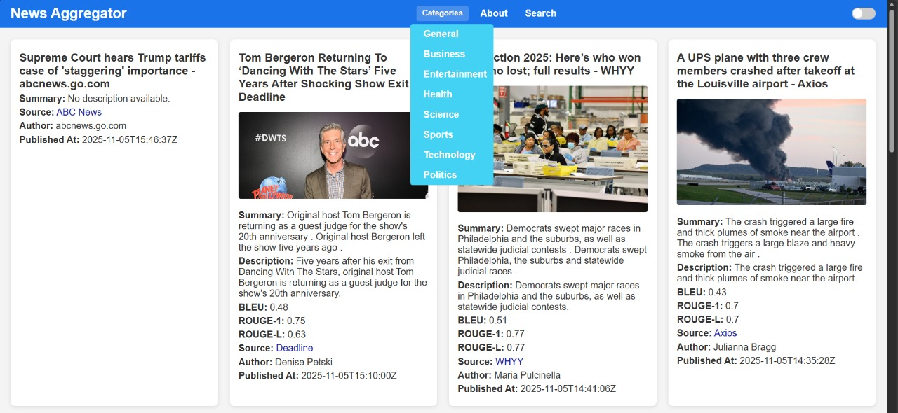
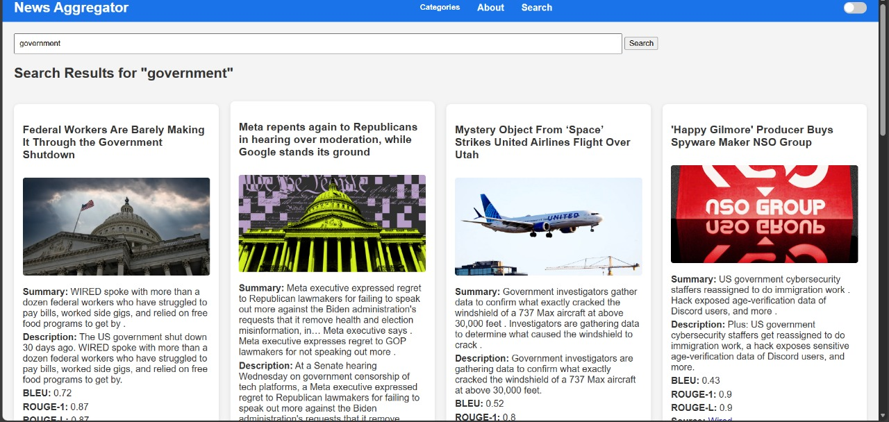

# AI-Powered News Intelligence Platform

🚀 **Live Demo:** [https://automated-news-summarizer.onrender.com](https://automated-news-summarizer.onrender.com)
---

# Overview

AI-Powered News Intelligence Platform is a full-stack NLP-based web application that fetches real-time news articles using NewsAPI and generates AI-powered summaries using Hugging Face Transformers.

The platform enables users to:

* Explore news across multiple categories
* Search for trending topics and articles
* Generate concise AI-powered summaries
* Evaluate generated summaries using BLEU and ROUGE metrics
* Access a responsive and user-friendly interface
* Experience cloud deployment on Render

This project combines Full-Stack Development, Natural Language Processing (NLP), and Cloud Deployment into a production-ready application.

---

# Features

✅ Real-time News Fetching using NewsAPI
✅ AI-Powered Text Summarization
✅ Hugging Face Transformer Integration
✅ Search Functionality
✅ Category-Based News Filtering
✅ BLEU & ROUGE Evaluation Metrics
✅ Responsive UI Design
✅ Dark Mode Support
✅ Flask-Based Backend Architecture
✅ Cloud Deployment using Render

---

# Tech Stack

## Frontend

* HTML5
* CSS3
* Jinja2 Templates

## Backend

* Python
* Flask

## AI / NLP

* Hugging Face Transformers
* DistilBART-CNN Model
* NLTK
* ROUGE Score

## APIs

* NewsAPI

## Deployment

* Render Cloud Platform
* Gunicorn

---

# System Architecture

```text
User Request
     ↓
Flask Backend
     ↓
NewsAPI Fetching
     ↓
Hugging Face Transformer Model
     ↓
Summary Generation
     ↓
BLEU & ROUGE Evaluation
     ↓
Rendered Frontend UI
```

---

# Project Screenshots

## Home Page


## News Summarization Output



## Search Functionality



---

# Installation & Setup

## Clone Repository

```bash
git clone https://github.com/bssadiya/AI-Powered-News-Intelligence-Platform.git
cd AI-Powered-News-Intelligence-Platform
```

---

## Create Virtual Environment

```bash
python -m venv venv
```

### Activate Virtual Environment

#### Windows

```bash
venv\Scripts\activate
```

#### Linux / MacOS

```bash
source venv/bin/activate
```

---

## Install Dependencies

```bash
pip install -r requirements.txt
```

---

## Configure Environment Variables

Create a `.env` file in the root directory.

```env
NEWS_API_KEY=your_api_key_here
```

Get your API key from:
[https://newsapi.org](https://newsapi.org)

---

# Run Application

```bash
python app.py
```

Open in browser:

```text
http://127.0.0.1:5000
```

---

# Deployment

The application is deployed on Render.

## Production Deployment

```text
https://automated-news-summarizer.onrender.com
```

---

# AI Model Used

## DistilBART CNN 12-6

Model:

```text
sshleifer/distilbart-cnn-12-6
```

This lightweight transformer model was selected for:

* Faster inference
* Reduced memory consumption
* Better cloud deployment compatibility
* Efficient abstractive summarization

---

# NLP Evaluation Metrics

## BLEU Score

Used to measure similarity between generated summary and reference text.

## ROUGE Score

Used to evaluate overlap between generated and reference summaries.

Metrics Implemented:

* ROUGE-1
* ROUGE-L

---

# Key Learning Outcomes

* Full-Stack Web Application Development
* Flask Backend Development
* REST API Integration
* NLP Model Integration
* Transformer-Based Summarization
* Cloud Deployment Workflow
* Environment Variable Management
* Git & GitHub Version Control
* Production Deployment using Render

---

# Future Enhancements

* User Authentication System
* Personalized News Recommendations
* Sentiment Analysis Dashboard
* Multi-Language Summarization
* Real-Time Trending Analytics
* Bookmark & Save Features
* Voice-Based News Summaries
* Advanced Search Filtering

---

# Resume-Oriented Highlights

* Developed and deployed an AI-powered full-stack news summarization platform using Flask, Hugging Face Transformers, and NewsAPI.
* Implemented NLP evaluation metrics including BLEU and ROUGE for generated summary assessment.
* Designed responsive frontend architecture with category-based filtering and search functionality.
* Integrated cloud deployment pipeline using Render and Gunicorn.
* Optimized transformer inference using lightweight DistilBART architecture for deployment compatibility.

---

# Author

## B. S. Sadiya

AI & Software Engineering Enthusiast
Passionate about Full-Stack Development, NLP, and Applied AI Systems.

GitHub: [https://github.com/bssadiya](https://github.com/bssadiya)

---

# License

This project is developed for educational, research, and portfolio purposes.


